# Rebloom Architecture Diagrams

## System Architecture Diagrams

### 1. High-Level System Architecture

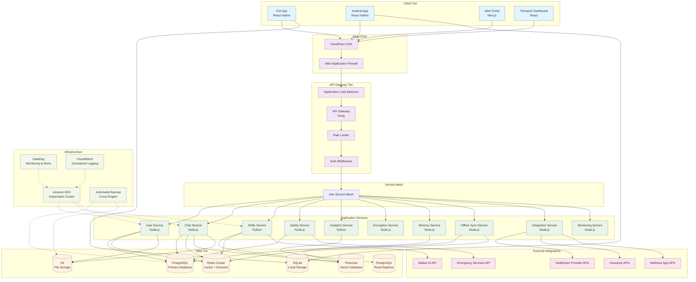

### 2. Security Architecture

```mermaid
graph TB
    subgraph "Client Security"
        ClientEnc[Client-Side Encryption]
        Biometric[Biometric Auth]
        LocalKey[Local Key Storage]
        DeviceAttest[Device Attestation]
    end
    
    subgraph "Network Security"
        TLS[TLS 1.3 Encryption]
        CertPin[Certificate Pinning]
        MTLS[Mutual TLS]
        WAF[Web Application Firewall]
    end
    
    subgraph "Authentication Layer"
        MFA[Multi-Factor Authentication]
        JWT[JWT Tokens]
        OAuth[OAuth 2.0 / OIDC]
        RiskAuth[Risk-Based Auth]
    end
    
    subgraph "Authorization Layer"
        RBAC[Role-Based Access Control]
        ABAC[Attribute-Based Access Control]
        PolicyEngine[Policy Engine]
        AccessMatrix[Access Control Matrix]
    end
    
    subgraph "Application Security"
        InputValid[Input Validation]
        SQLInject[SQL Injection Protection]
        XSSProtect[XSS Protection]
        CSRFProtect[CSRF Protection]
        RateLimit[Rate Limiting]
    end
    
    subgraph "Data Security"
        E2EEncryption[End-to-End Encryption]
        FieldEncryption[Field-Level Encryption]
        KeyRotation[Automatic Key Rotation]
        HSM[Hardware Security Module]
        DataMasking[Data Masking]
    end
    
    subgraph "Infrastructure Security"
        VPC[Private VPC]
        SecurityGroups[Security Groups]
        NetworkACL[Network ACLs]
        Bastion[Bastion Host]
        VPN[Site-to-Site VPN]
    end
    
    subgraph "Compliance & Audit"
        AuditLog[Comprehensive Audit Logs]
        HIPAA[HIPAA Compliance]
        GDPR[GDPR Compliance]
        SOC2[SOC 2 Type II]
        PenTest[Regular Penetration Testing]
    end
    
    subgraph "Crisis Security"
        CrisisDetect[Crisis Detection ML]
        RiskAssess[Risk Assessment Engine]
        EmergencyProto[Emergency Protocols]
        ProfessionalAlert[Professional Alerts]
    end
    
    subgraph "Monitoring & Response"
        SIEM[Security Information Event Management]
        Intrusion[Intrusion Detection]
        Anomaly[Anomaly Detection]
        IncidentResp[Incident Response]
        ThreatIntel[Threat Intelligence]
    end
    
    %% Security Flow
    ClientEnc --> E2EEncryption
    Biometric --> MFA
    LocalKey --> KeyRotation
    
    TLS --> E2EEncryption
    CertPin --> TLS
    MTLS --> TLS
    
    MFA --> JWT
    OAuth --> JWT
    RiskAuth --> MFA
    
    RBAC --> PolicyEngine
    ABAC --> PolicyEngine
    PolicyEngine --> AccessMatrix
    
    InputValid --> SQLInject
    SQLInject --> XSSProtect
    XSSProtect --> CSRFProtect
    
    E2EEncryption --> FieldEncryption
    FieldEncryption --> HSM
    KeyRotation --> HSM
    
    VPC --> SecurityGroups
    SecurityGroups --> NetworkACL
    
    AuditLog --> HIPAA
    HIPAA --> GDPR
    GDPR --> SOC2
    
    CrisisDetect --> RiskAssess
    RiskAssess --> EmergencyProto
    EmergencyProto --> ProfessionalAlert
    
    SIEM --> Intrusion
    Intrusion --> Anomaly
    Anomaly --> IncidentResp
    
    classDef client fill:#e1f5fe
    classDef network fill:#f3e5f5
    classDef auth fill:#e8f5e8
    classDef app fill:#fff3e0
    classDef data fill:#fce4ec
    classDef infra fill:#f1f8e9
    classDef compliance fill:#e0f2f1
    classDef crisis fill:#fff8e1
    classDef monitor fill:#fce4ec
    
    class ClientEnc,Biometric,LocalKey,DeviceAttest client
    class TLS,CertPin,MTLS,WAF network
    class MFA,JWT,OAuth,RiskAuth auth
    class InputValid,SQLInject,XSSProtect,CSRFProtect,RateLimit app
    class E2EEncryption,FieldEncryption,KeyRotation,HSM,DataMasking data
    class VPC,SecurityGroups,NetworkACL,Bastion,VPN infra
    class AuditLog,HIPAA,GDPR,SOC2,PenTest compliance
    class CrisisDetect,RiskAssess,EmergencyProto,ProfessionalAlert crisis
    class SIEM,Intrusion,Anomaly,IncidentResp,ThreatIntel monitor
```

### 3. AI/ML Architecture

```mermaid
graph TB
    subgraph "Data Ingestion"
        TextInput[Text Input]
        VoiceInput[Voice Input]
        BehaviorData[Behavioral Data]
        ContextData[Context Data]
        HistoryData[Historical Data]
    end
    
    subgraph "Preprocessing Pipeline"
        TextPreprocess[Text Preprocessing<br/>NLP Pipeline]
        VoicePreprocess[Voice Feature Extraction<br/>Audio Processing]
        DataClean[Data Cleaning & Normalization]
        FeatureEng[Feature Engineering]
    end
    
    subgraph "AI/ML Models"
        LLMService[Large Language Model<br/>Bailian AI]
        SentimentModel[Sentiment Analysis<br/>BERT-based]
        EmotionModel[Emotion Detection<br/>Multi-label Classification]
        CrisisModel[Crisis Detection<br/>Ensemble Model]
        MoodModel[Mood Analysis<br/>Regression Model]
        PersonalityModel[Personality Modeling<br/>Big Five + Clinical]
        VoiceModel[Voice Analysis<br/>Paralinguistic Features]
    end
    
    subgraph "Analysis Engines"
        MoodEngine[Real-time Mood Analysis]
        CrisisEngine[Crisis Detection Engine]
        PersonalizeEngine[Personalization Engine]
        PatternEngine[Behavioral Pattern Analysis]
        PredictEngine[Predictive Analytics]
    end
    
    subgraph "Decision Systems"
        RiskAssess[Risk Assessment System]
        InterventionDecision[Intervention Decision Tree]
        ResponseGeneration[Response Generation]
        RecommendationEngine[Recommendation Engine]
    end
    
    subgraph "Model Management"
        ModelServing[Model Serving Infrastructure]
        ModelMonitor[Model Performance Monitoring]
        ABTesting[A/B Testing Framework]
        ModelUpdate[Automated Model Updates]
        BiasDetection[Bias Detection & Mitigation]
    end
    
    subgraph "Data Storage & Memory"
        VectorStore[(Vector Database<br/>Pinecone)]
        ModelStore[(Model Registry<br/>MLflow)]
        ConversationMemory[(Conversation Context<br/>Redis)]
        UserProfile[(User Profiles<br/>PostgreSQL)]
        TrainingData[(Training Data<br/>S3)]
    end
    
    subgraph "Privacy & Ethics"
        DataAnonymize[Data Anonymization]
        DifferentialPrivacy[Differential Privacy]
        ModelExplain[Model Explainability]
        EthicsCheck[Ethics & Bias Checking]
        ConsentManage[Consent Management]
    end
    
    %% Data Flow
    TextInput --> TextPreprocess
    VoiceInput --> VoicePreprocess
    BehaviorData --> DataClean
    ContextData --> FeatureEng
    HistoryData --> FeatureEng
    
    TextPreprocess --> LLMService
    TextPreprocess --> SentimentModel
    TextPreprocess --> EmotionModel
    TextPreprocess --> CrisisModel
    VoicePreprocess --> VoiceModel
    DataClean --> MoodModel
    FeatureEng --> PersonalityModel
    
    LLMService --> MoodEngine
    SentimentModel --> MoodEngine
    EmotionModel --> MoodEngine
    CrisisModel --> CrisisEngine
    MoodModel --> MoodEngine
    PersonalityModel --> PersonalizeEngine
    VoiceModel --> PatternEngine
    
    MoodEngine --> RiskAssess
    CrisisEngine --> InterventionDecision
    PersonalizeEngine --> ResponseGeneration
    PatternEngine --> PredictEngine
    
    RiskAssess --> ResponseGeneration
    InterventionDecision --> ResponseGeneration
    ResponseGeneration --> RecommendationEngine
    
    ModelServing -.-> LLMService
    ModelServing -.-> SentimentModel
    ModelMonitor -.-> ModelUpdate
    ABTesting -.-> ModelUpdate
    BiasDetection -.-> EthicsCheck
    
    %% Storage Connections
    MoodEngine --> VectorStore
    PersonalizeEngine --> UserProfile
    PatternEngine --> ConversationMemory
    ModelUpdate --> ModelStore
    DataClean --> TrainingData
    
    %% Privacy Layer
    DataAnonymize -.-> DataClean
    DifferentialPrivacy -.-> ModelServing
    ModelExplain -.-> ResponseGeneration
    EthicsCheck -.-> InterventionDecision
    ConsentManage -.-> DataAnonymize
    
    classDef input fill:#e1f5fe
    classDef preprocess fill:#f3e5f5
    classDef model fill:#e8f5e8
    classDef engine fill:#fff3e0
    classDef decision fill:#fce4ec
    classDef management fill:#f1f8e9
    classDef storage fill:#e0f2f1
    classDef privacy fill:#fff8e1
    
    class TextInput,VoiceInput,BehaviorData,ContextData,HistoryData input
    class TextPreprocess,VoicePreprocess,DataClean,FeatureEng preprocess
    class LLMService,SentimentModel,EmotionModel,CrisisModel,MoodModel,PersonalityModel,VoiceModel model
    class MoodEngine,CrisisEngine,PersonalizeEngine,PatternEngine,PredictEngine engine
    class RiskAssess,InterventionDecision,ResponseGeneration,RecommendationEngine decision
    class ModelServing,ModelMonitor,ABTesting,ModelUpdate,BiasDetection management
    class VectorStore,ModelStore,ConversationMemory,UserProfile,TrainingData storage
    class DataAnonymize,DifferentialPrivacy,ModelExplain,EthicsCheck,ConsentManage privacy
```

### 4. Data Flow Architecture

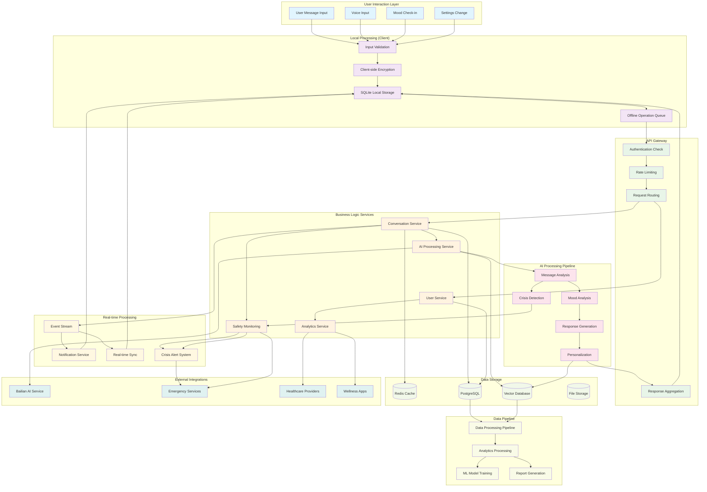

### 5. Offline-First Synchronization

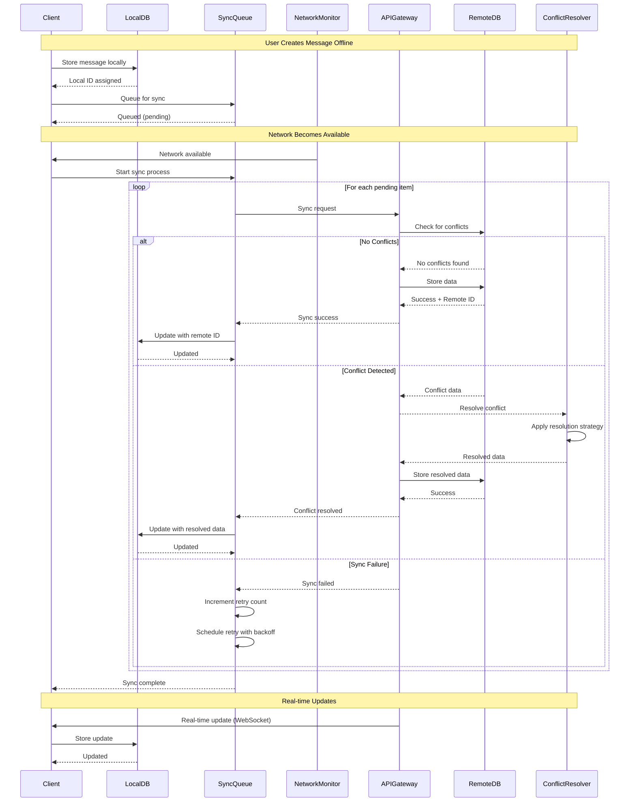

### 6. Crisis Detection and Response Flow

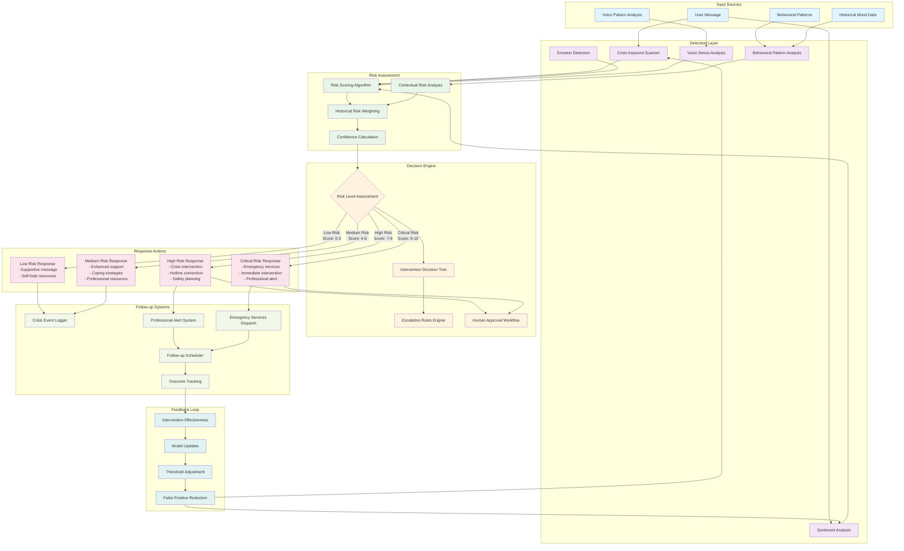

### 7. Integration Architecture

```mermaid
graph TB
    subgraph "Rebloom Core System"
        CoreAPI[Rebloom Core API]
        UserData[(User Data)]
        ConversationData[(Conversations)]
        AnalyticsEngine[Analytics Engine]
        CrisisSystem[Crisis Detection]
    end
    
    subgraph "Emergency Services Integration"
        EmergencyAPI[Emergency Services API]
        CrisisHotlines[Crisis Hotlines]
        LocalEmergency[Local Emergency Services]
        HospitalNetworks[Hospital Networks]
        MentalHealthCrisis[Mental Health Crisis Teams]
    end
    
    subgraph "Healthcare Provider Integration"
        EHRSystems[EHR Systems<br/>Epic, Cerner, AllScripts]
        TelehealthPlatforms[Telehealth Platforms<br/>Teladoc, Amwell]
        TherapistNetworks[Therapist Networks<br/>Psychology Today, BetterHelp]
        InsuranceSystems[Insurance Systems<br/>Claims, Coverage]
        PharmacySystems[Pharmacy Systems<br/>Prescription Management]
    end
    
    subgraph "Wellness Ecosystem"
        FitnessTrackers[Fitness Trackers<br/>Apple Health, Google Fit]
        SleepMonitoring[Sleep Monitoring<br/>Fitbit, Oura Ring]
        MeditationApps[Meditation Apps<br/>Headspace, Calm]
        NutritionTracking[Nutrition Apps<br/>MyFitnessPal]
        JournalApps[Journal Apps<br/>Day One, Journey]
    end
    
    subgraph "AI/ML Services"
        BailianAI[Bailian AI<br/>Primary LLM]
        OpenAI[OpenAI GPT<br/>Fallback LLM]
        GoogleAI[Google AI<br/>Language Processing]
        AWSComprehend[AWS Comprehend<br/>Sentiment Analysis]
        AzureCognitive[Azure Cognitive<br/>Speech Analysis]
    end
    
    subgraph "Communication Services"
        TwilioSMS[Twilio SMS<br/>Crisis Notifications]
        SendGridEmail[SendGrid Email<br/>Professional Communications]
        PushNotifications[Push Notifications<br/>FCM/APNS]
        WebRTC[WebRTC<br/>Crisis Video Calls]
        SlackIntegration[Slack Integration<br/>Professional Alerts]
    end
    
    subgraph "Compliance & Security"
        HIPAAVault[HIPAA Vault<br/>PHI Storage]
        ComplianceAPIs[Compliance APIs<br/>SOC 2, GDPR]
        AuditSystems[Audit Systems<br/>Compliance Logging]
        SecurityScanning[Security Scanning<br/>Vulnerability Assessment]
        EncryptionServices[Encryption Services<br/>Key Management]
    end
    
    subgraph "Analytics & Monitoring"
        DatadogAPM[Datadog APM<br/>Performance Monitoring]
        SentryErrors[Sentry<br/>Error Tracking]
        MixpanelAnalytics[Mixpanel<br/>User Analytics]
        TableauBI[Tableau<br/>Business Intelligence]
        ElasticSearch[ElasticSearch<br/>Log Analytics]
    end
    
    subgraph "Infrastructure Services"
        AWSServices[AWS Services<br/>RDS, S3, EKS]
        CloudflareProxy[Cloudflare<br/>CDN, DDoS Protection]
        DockerRegistry[Docker Registry<br/>Container Images]
        KubernetesOrch[Kubernetes<br/>Orchestration]
        TerraformIaC[Terraform<br/>Infrastructure as Code]
    end
    
    %% Core System Connections
    CoreAPI --> UserData
    CoreAPI --> ConversationData
    CoreAPI --> AnalyticsEngine
    CoreAPI --> CrisisSystem
    
    %% Emergency Services
    CrisisSystem --> EmergencyAPI
    EmergencyAPI --> CrisisHotlines
    EmergencyAPI --> LocalEmergency
    EmergencyAPI --> HospitalNetworks
    EmergencyAPI --> MentalHealthCrisis
    
    %% Healthcare Providers
    CoreAPI --> EHRSystems
    CoreAPI --> TelehealthPlatforms
    CoreAPI --> TherapistNetworks
    CoreAPI --> InsuranceSystems
    CoreAPI --> PharmacySystems
    
    %% Wellness Integrations
    AnalyticsEngine --> FitnessTrackers
    AnalyticsEngine --> SleepMonitoring
    AnalyticsEngine --> MeditationApps
    AnalyticsEngine --> NutritionTracking
    AnalyticsEngine --> JournalApps
    
    %% AI Services
    CoreAPI --> BailianAI
    CoreAPI --> OpenAI
    CoreAPI --> GoogleAI
    CoreAPI --> AWSComprehend
    CoreAPI --> AzureCognitive
    
    %% Communication
    CrisisSystem --> TwilioSMS
    CoreAPI --> SendGridEmail
    CoreAPI --> PushNotifications
    CrisisSystem --> WebRTC
    CrisisSystem --> SlackIntegration
    
    %% Security & Compliance
    UserData --> HIPAAVault
    CoreAPI --> ComplianceAPIs
    CoreAPI --> AuditSystems
    CoreAPI --> SecurityScanning
    CoreAPI --> EncryptionServices
    
    %% Monitoring
    CoreAPI --> DatadogAPM
    CoreAPI --> SentryErrors
    AnalyticsEngine --> MixpanelAnalytics
    AnalyticsEngine --> TableauBI
    CoreAPI --> ElasticSearch
    
    %% Infrastructure
    CoreAPI --> AWSServices
    CoreAPI --> CloudflareProxy
    CoreAPI --> DockerRegistry
    CoreAPI --> KubernetesOrch
    CoreAPI --> TerraformIaC
    
    classDef core fill:#e1f5fe
    classDef emergency fill:#ffebee
    classDef healthcare fill:#f3e5f5
    classDef wellness fill:#e8f5e8
    classDef ai fill:#fff3e0
    classDef communication fill:#fce4ec
    classDef security fill:#f1f8e9
    classDef analytics fill:#e0f2f1
    classDef infrastructure fill:#fff8e1
    
    class CoreAPI,UserData,ConversationData,AnalyticsEngine,CrisisSystem core
    class EmergencyAPI,CrisisHotlines,LocalEmergency,HospitalNetworks,MentalHealthCrisis emergency
    class EHRSystems,TelehealthPlatforms,TherapistNetworks,InsuranceSystems,PharmacySystems healthcare
    class FitnessTrackers,SleepMonitoring,MeditationApps,NutritionTracking,JournalApps wellness
    class BailianAI,OpenAI,GoogleAI,AWSComprehend,AzureCognitive ai
    class TwilioSMS,SendGridEmail,PushNotifications,WebRTC,SlackIntegration communication
    class HIPAAVault,ComplianceAPIs,AuditSystems,SecurityScanning,EncryptionServices security
    class DatadogAPM,SentryErrors,MixpanelAnalytics,TableauBI,ElasticSearch analytics
    class AWSServices,CloudflareProxy,DockerRegistry,KubernetesOrch,TerraformIaC infrastructure
```

### 8. Deployment Pipeline

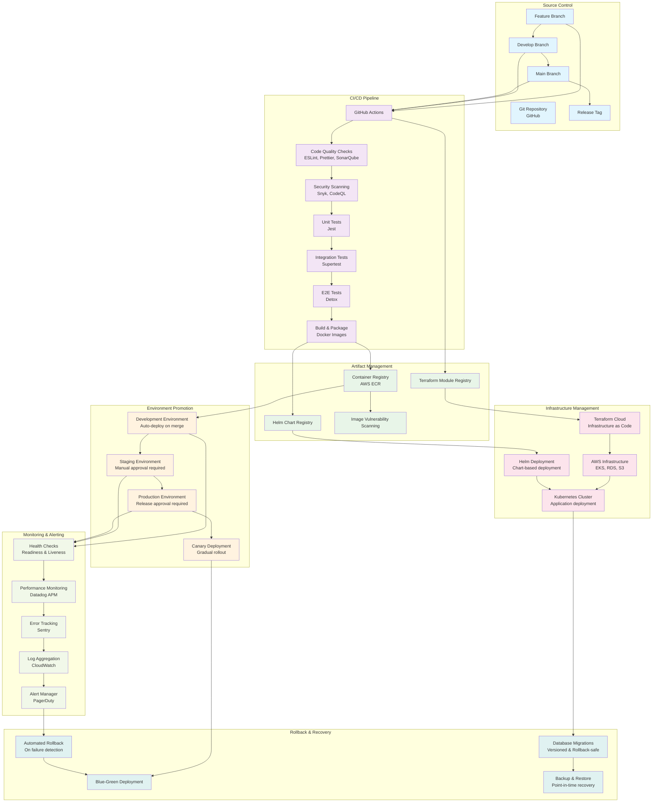

## Component Interaction Patterns

### 1. Request-Response Flow
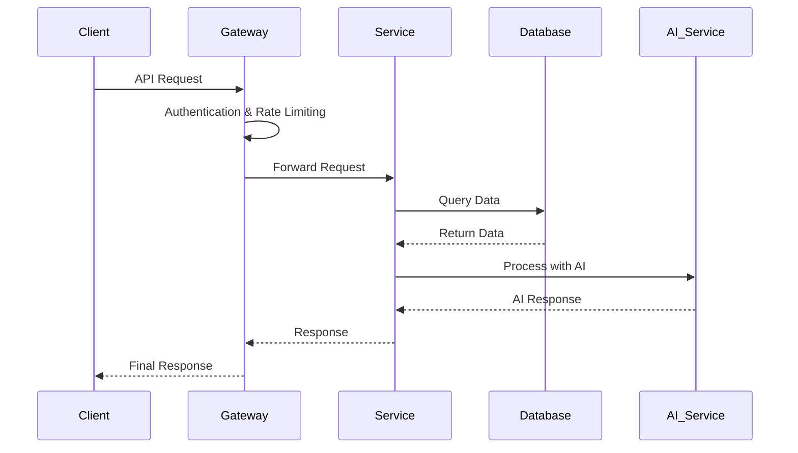

### 2. Event-Driven Architecture
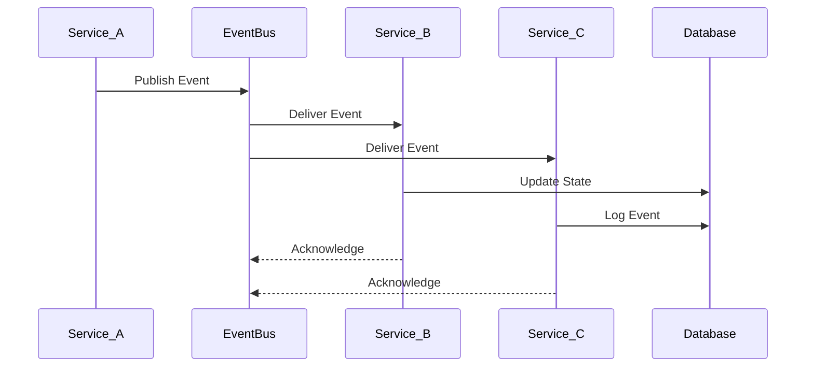

### 3. Crisis Detection Workflow
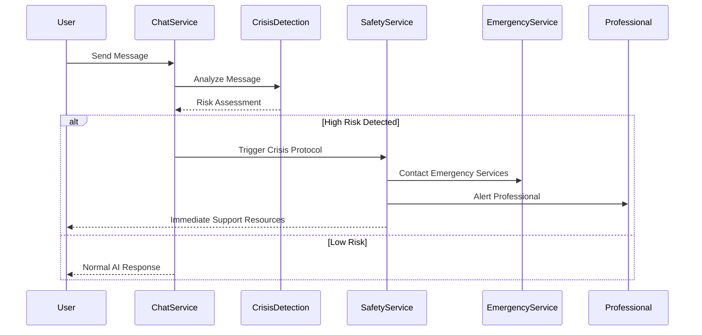

This comprehensive set of architectural diagrams provides visual representations of all major system components, data flows, and interaction patterns for the Rebloom mental health AI application.