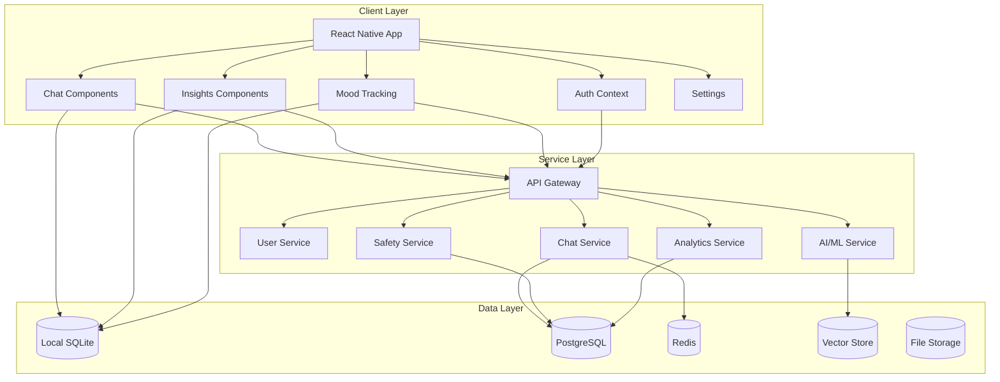

# Rebloom Mental Health AI App - Comprehensive System Architecture Design

## Executive Summary

This document presents a comprehensive system architecture design for Rebloom, an AI-powered mental health companion app. The architecture enhances the existing React Native + TypeScript + Supabase foundation with advanced security, AI/ML capabilities, offline-first functionality, and crisis detection systems while ensuring HIPAA compliance and scalability.

## Table of Contents
1. [System Overview](#1-system-overview)
2. [Security Architecture](#2-security-architecture) 
3. [AI/ML Architecture](#3-aiml-architecture)
4. [Data Architecture](#4-data-architecture)
5. [Integration Architecture](#5-integration-architecture)
6. [Component Architecture](#6-component-architecture)
7. [Deployment Architecture](#7-deployment-architecture)
8. [Architecture Decision Records](#8-architecture-decision-records)

---

## 1. System Overview

### 1.1 High-Level Architecture

```
┌─────────────────────────────────────────────────────────────────────┐
│                            CLIENT LAYER                             │
├─────────────────┬─────────────────┬─────────────────┬──────────────┤
│   iOS App       │   Android App   │   Web Portal    │ Therapist    │
│ (React Native)  │ (React Native)  │   (Next.js)     │ Dashboard    │
│                 │                 │                 │ (React)      │
└─────────────────┴─────────────────┴─────────────────┴──────────────┘
                              │
                    ┌─────────┴─────────┐
                    │   API Gateway     │
                    │ (Kong/AWS ALB)    │
                    │ Rate Limiting     │
                    │ Authentication    │
                    └─────────┬─────────┘
                              │
┌─────────────────────────────┼─────────────────────────────────────────┐
│                       SERVICE MESH                                   │
│                    (Istio/Linkerd)                                   │
└─────────────────────────────┼─────────────────────────────────────────┘
                              │
┌─────────────┬───────────────┼───────────────┬─────────────┬─────────────┐
│   User      │ Conversation  │   AI/ML       │   Safety    │  Analytics  │
│  Service    │   Service     │   Service     │  Service    │   Service   │
│             │               │               │             │             │
│ - Auth      │ - Real-time   │ - Mood Anal.  │ - Crisis    │ - Insights  │
│ - Profiles  │ - Chat        │ - NLP         │   Detection │ - Patterns  │
│ - Prefs     │ - History     │ - Response    │ - Emergency │ - Reports   │
└─────────────┴───────────────┴───────────────┴─────────────┴─────────────┘
                              │
┌─────────────┬───────────────┼───────────────┬─────────────┬─────────────┐
│ Encryption  │   Memory      │   Offline     │ Integration │  Monitoring │
│  Service    │   Service     │    Sync       │   Service   │   Service   │
│             │               │   Service     │             │             │
│ - E2E Keys  │ - Context     │ - Local Store │ - Emergency │ - Metrics   │
│ - PHI Enc.  │ - Vector DB   │ - Conflict    │ - Healthcare│ - Alerts    │
│ - Audit     │ - Memory      │   Resolution  │ - Insurance │ - Logs      │
└─────────────┴───────────────┴───────────────┴─────────────┴─────────────┘
                              │
┌─────────────────────────────┼─────────────────────────────────────────┐
│                         DATA LAYER                                   │
├─────────────┬───────────────┴───────────────┬─────────────┬───────────┤
│ PostgreSQL  │        Redis Cluster          │ Vector DB   │ File Store│
│ (Primary)   │    (Cache + Real-time)       │(Pinecone)   │  (S3/GCS) │
│             │                               │             │           │
│ - Users     │ - Sessions                    │ - Embeddings│ - Media   │
│ - Messages  │ - Real-time state            │ - Similarity│ - Backups │
│ - Analytics │ - Offline queue              │ - Context   │ - Exports │
└─────────────┴───────────────────────────────┴─────────────┴───────────┘
```

### 1.2 Architecture Principles

**1. Privacy-First Design**
- End-to-end encryption for all PHI
- Zero-knowledge architecture where possible
- Client-side encryption keys
- Minimal data collection

**2. Offline-First Approach**
- Local-first data storage
- Intelligent sync when online
- Graceful degradation
- Conflict resolution

**3. Crisis Safety Priority**
- Real-time crisis detection
- Multi-layer safety checks
- Immediate intervention paths
- Professional oversight integration

**4. Scalable & Resilient**
- Microservices architecture
- Event-driven communication
- Auto-scaling capabilities
- Fault tolerance

---

## 2. Security Architecture

### 2.1 End-to-End Encryption Design

```typescript
/**
 * Client-Side Encryption Architecture
 * - Each user has unique encryption keys
 * - Messages encrypted before transmission
 * - Server never sees plaintext PHI
 */

interface EncryptionService {
  // Key Management
  generateUserKeys(): Promise<KeyPair>
  deriveEncryptionKey(password: string, salt: string): Promise<string>
  rotateKeys(userId: string): Promise<void>
  
  // Message Encryption
  encryptMessage(message: string, recipientKey: string): Promise<EncryptedMessage>
  decryptMessage(encrypted: EncryptedMessage, privateKey: string): Promise<string>
  
  // PHI Protection
  encryptPHI(data: PHIData, userKey: string): Promise<string>
  anonymizeData(data: any): Promise<AnonymizedData>
}

class ClientSideEncryption implements EncryptionService {
  private async generateUserKeys(): Promise<KeyPair> {
    // Use Web Crypto API / Expo Crypto
    return await crypto.subtle.generateKey(
      {
        name: "RSA-OAEP",
        modulusLength: 4096,
        publicExponent: new Uint8Array([1, 0, 1]),
        hash: "SHA-256"
      },
      true,
      ["encrypt", "decrypt"]
    )
  }
  
  async encryptMessage(message: string, userKey: string): Promise<EncryptedMessage> {
    // Generate random IV
    const iv = crypto.getRandomValues(new Uint8Array(16))
    
    // Derive key from user master key
    const key = await this.deriveKey(userKey, iv)
    
    // Encrypt message
    const encrypted = await crypto.subtle.encrypt(
      { name: "AES-GCM", iv },
      key,
      new TextEncoder().encode(message)
    )
    
    return {
      data: Array.from(new Uint8Array(encrypted)),
      iv: Array.from(iv),
      version: "v1",
      timestamp: Date.now()
    }
  }
}
```

### 2.2 HIPAA Compliance Architecture

```typescript
/**
 * HIPAA Compliance Layer
 * - Audit logging for all PHI access
 * - Access controls and permissions
 * - Data retention policies
 * - Breach detection and notification
 */

class HIPAAComplianceService {
  private auditLogger: AuditLogger
  private accessControl: AccessControl
  private dataGovernance: DataGovernance
  
  // Audit Trail
  async logPHIAccess(event: PHIAccessEvent): Promise<void> {
    await this.auditLogger.log({
      userId: event.userId,
      action: event.action,
      dataType: event.dataType,
      ipAddress: event.ipAddress,
      userAgent: event.userAgent,
      timestamp: new Date(),
      result: event.result,
      riskLevel: await this.assessRisk(event)
    })
  }
  
  // Access Control
  async validateAccess(userId: string, resource: string): Promise<boolean> {
    const permissions = await this.accessControl.getUserPermissions(userId)
    const context = await this.getAccessContext()
    
    return await this.accessControl.evaluate({
      permissions,
      resource,
      context,
      timestamp: new Date()
    })
  }
  
  // Data Governance
  async applyRetentionPolicy(data: PHIData): Promise<void> {
    const policy = await this.dataGovernance.getPolicy(data.type)
    
    if (this.shouldRetain(data, policy)) {
      await this.archiveData(data)
    } else {
      await this.secureDelete(data)
    }
  }
}
```

### 2.3 Authentication & Authorization

```typescript
/**
 * Multi-Factor Authentication System
 * - Biometric authentication
 * - Time-based OTP
 * - Risk-based authentication
 */

interface AuthenticationService {
  // Primary Authentication
  authenticateUser(credentials: LoginCredentials): Promise<AuthResult>
  verifyBiometric(userId: string, biometricData: BiometricData): Promise<boolean>
  
  // Multi-Factor
  sendOTP(userId: string, method: 'sms' | 'email'): Promise<void>
  verifyOTP(userId: string, code: string): Promise<boolean>
  
  // Risk Assessment
  assessLoginRisk(context: LoginContext): Promise<RiskLevel>
  requireAdditionalVerification(risk: RiskLevel): boolean
}

class AdvancedAuthService implements AuthenticationService {
  async authenticateUser(credentials: LoginCredentials): Promise<AuthResult> {
    // 1. Risk Assessment
    const risk = await this.assessLoginRisk({
      ipAddress: credentials.ipAddress,
      deviceFingerprint: credentials.deviceFingerprint,
      location: credentials.location,
      timeOfDay: new Date()
    })
    
    // 2. Primary Authentication
    const user = await this.validateCredentials(credentials)
    if (!user) throw new AuthenticationError('Invalid credentials')
    
    // 3. Risk-based MFA
    if (this.requireAdditionalVerification(risk)) {
      return {
        status: 'mfa_required',
        methods: await this.getAvailableMFAMethods(user.id),
        sessionToken: await this.createTempSession(user.id)
      }
    }
    
    // 4. Generate secure session
    const session = await this.createSession(user, risk)
    return { status: 'success', session, user: this.sanitizeUser(user) }
  }
}
```

---

## 3. AI/ML Architecture

### 3.1 Real-Time Mood Analysis Pipeline

```typescript
/**
 * Advanced Mood Analysis System
 * - Multi-modal analysis (text, voice, patterns)
 * - Real-time processing with caching
 * - Confidence scoring and uncertainty handling
 */

interface MoodAnalysisService {
  analyzeText(text: string, context: ConversationContext): Promise<MoodAnalysis>
  analyzeVoice(audioData: Buffer, duration: number): Promise<VoiceAnalysis>
  analyzePatterns(userId: string, timeframe: TimeFrame): Promise<PatternAnalysis>
  fuseMoodData(analyses: MoodAnalysis[]): Promise<ComprehensiveMoodState>
}

class AdvancedMoodAnalyzer implements MoodAnalysisService {
  private textAnalyzer: TextMoodAnalyzer
  private voiceAnalyzer: VoiceAnalyzer
  private patternDetector: PatternDetector
  private fusionEngine: DataFusionEngine
  
  async analyzeText(text: string, context: ConversationContext): Promise<MoodAnalysis> {
    // 1. Preprocess text
    const processed = await this.preprocessText(text)
    
    // 2. Multi-model analysis
    const analyses = await Promise.all([
      this.textAnalyzer.analyzeSentiment(processed),
      this.textAnalyzer.analyzeEmotions(processed),
      this.textAnalyzer.analyzeAnxietyMarkers(processed),
      this.textAnalyzer.analyzeDepressionMarkers(processed),
      this.textAnalyzer.analyzeStressIndicators(processed)
    ])
    
    // 3. Contextual adjustment
    const contextualAnalysis = await this.adjustForContext(analyses, context)
    
    // 4. Confidence scoring
    const confidence = await this.calculateConfidence(contextualAnalysis, context.conversationHistory)
    
    return {
      mood: contextualAnalysis.primaryMood,
      emotions: contextualAnalysis.emotions,
      anxiety: contextualAnalysis.anxietyLevel,
      depression: contextualAnalysis.depressionIndicators,
      stress: contextualAnalysis.stressLevel,
      confidence,
      timestamp: new Date(),
      analysisVersion: 'v2.1'
    }
  }
  
  async analyzeVoice(audioData: Buffer, duration: number): Promise<VoiceAnalysis> {
    // Voice feature extraction
    const features = await this.voiceAnalyzer.extractFeatures(audioData, {
      sampleRate: 44100,
      windowSize: 2048,
      hopSize: 512
    })
    
    // Multi-dimensional analysis
    return {
      pitch: await this.analyzePitchVariations(features.pitch),
      energy: await this.analyzeEnergyLevels(features.energy),
      rhythm: await this.analyzeSpeechRhythm(features.rhythm),
      pauses: await this.analyzePausePatterns(features.pauses),
      emotionalMarkers: await this.detectEmotionalMarkers(features),
      stressIndicators: await this.detectStressIndicators(features),
      confidence: features.quality > 0.8 ? 'high' : 'medium'
    }
  }
}
```

### 3.2 Crisis Detection System

```typescript
/**
 * Multi-Layer Crisis Detection System
 * - Real-time text analysis
 * - Behavioral pattern monitoring
 * - Escalation protocols
 * - Professional notification system
 */

class CrisisDetectionSystem {
  private textAnalyzer: CrisisTextAnalyzer
  private patternMonitor: BehavioralPatternMonitor
  private escalationService: EscalationService
  private notificationService: ProfessionalNotificationService
  
  async analyzeMessage(
    message: string, 
    userId: string, 
    context: ConversationContext
  ): Promise<CrisisAssessment> {
    // 1. Immediate keyword scanning
    const keywordRisk = await this.scanCrisisKeywords(message)
    
    // 2. Contextual sentiment analysis
    const sentimentRisk = await this.analyzeCrisisSentiment(message, context)
    
    // 3. Behavioral pattern analysis
    const patternRisk = await this.patternMonitor.analyzeRecentBehavior(userId, {
      lookback: '7d',
      includeConversations: true,
      includeMoodData: true
    })
    
    // 4. Risk fusion and scoring
    const overallRisk = await this.fuseRiskAssessments([
      keywordRisk,
      sentimentRisk,
      patternRisk
    ])
    
    // 5. Trigger interventions if needed
    if (overallRisk.level >= RiskLevel.HIGH) {
      await this.triggerCrisisProtocol(userId, overallRisk)
    }
    
    return {
      riskLevel: overallRisk.level,
      confidence: overallRisk.confidence,
      triggers: overallRisk.triggers,
      recommendedActions: overallRisk.actions,
      timeToIntervention: overallRisk.urgency,
      assessment: overallRisk.assessment,
      timestamp: new Date()
    }
  }
  
  private async triggerCrisisProtocol(userId: string, risk: RiskAssessment): Promise<void> {
    // 1. Log crisis event
    await this.logCrisisEvent(userId, risk)
    
    // 2. Immediate user support
    await this.provideCrisisResources(userId, risk.level)
    
    // 3. Professional notification (if critical)
    if (risk.level === RiskLevel.CRITICAL) {
      await this.notificationService.alertProfessionals({
        userId,
        riskLevel: risk.level,
        triggers: risk.triggers,
        recommendedActions: ['immediate_intervention', 'emergency_contact'],
        timestamp: new Date()
      })
    }
    
    // 4. Escalate to emergency services if needed
    if (risk.triggers.includes('imminent_self_harm')) {
      await this.escalationService.contactEmergencyServices(userId)
    }
  }
}
```

### 3.3 Personalization Engine

```typescript
/**
 * Advanced Personalization System
 * - User personality modeling
 * - Adaptive conversation style
 * - Therapeutic technique matching
 * - Learning from interactions
 */

class PersonalizationEngine {
  private personalityModeler: PersonalityModeler
  private styleAdapter: ConversationStyleAdapter
  private techniqueSelector: TherapeuticTechniqueSelector
  private learningEngine: ContinuousLearningEngine
  
  async personalizeResponse(
    baseResponse: string,
    userId: string,
    context: ConversationContext
  ): Promise<PersonalizedResponse> {
    // 1. Get user personality model
    const personality = await this.personalityModeler.getUserModel(userId)
    
    // 2. Determine optimal therapeutic approach
    const approach = await this.techniqueSelector.selectApproach({
      userHistory: context.conversationHistory,
      currentMood: context.currentMood,
      personalityTraits: personality.traits,
      previousEffectiveness: personality.responseHistory
    })
    
    // 3. Adapt conversation style
    const stylePreferences = {
      formality: personality.preferredFormality,
      empathyLevel: personality.preferredEmpathy,
      directness: personality.preferredDirectness,
      culturalContext: personality.culturalBackground
    }
    
    const adaptedResponse = await this.styleAdapter.adapt(
      baseResponse,
      stylePreferences,
      approach
    )
    
    // 4. Add personalized elements
    const personalizedResponse = await this.addPersonalElements(
      adaptedResponse,
      personality,
      context
    )
    
    return {
      content: personalizedResponse,
      therapeuticApproach: approach,
      confidenceScore: await this.calculatePersonalizationConfidence(personality),
      adaptations: this.getAdaptationSummary(stylePreferences),
      learningFeedback: await this.generateLearningFeedback(userId, context)
    }
  }
}
```

---

## 4. Data Architecture

### 4.1 Offline-First Storage Strategy

```typescript
/**
 * Offline-First Data Architecture
 * - Local SQLite database for primary storage
 * - Intelligent sync with conflict resolution
 * - Progressive data loading
 * - Background synchronization
 */

class OfflineDataManager {
  private localDB: SQLiteDatabase
  private syncEngine: DataSyncEngine
  private conflictResolver: ConflictResolver
  private backgroundSync: BackgroundSyncService
  
  async initialize(): Promise<void> {
    // Initialize local SQLite database
    this.localDB = await SQLite.openDatabase('rebloom_local.db')
    
    // Create offline-first schema
    await this.createLocalSchema()
    
    // Setup background sync
    await this.backgroundSync.initialize({
      interval: 30000, // 30 seconds
      strategy: 'intelligent', // Only sync when needed
      conflictResolution: 'last_writer_wins_with_merge'
    })
  }
  
  // Local-first operations
  async saveConversation(conversation: Conversation): Promise<string> {
    // 1. Save locally immediately
    const localId = await this.localDB.insert('conversations', {
      ...conversation,
      syncStatus: 'pending',
      lastModified: Date.now(),
      version: 1
    })
    
    // 2. Queue for background sync
    await this.syncEngine.queueForSync('conversations', localId)
    
    return localId
  }
  
  async getConversations(userId: string): Promise<Conversation[]> {
    // Always return from local database first
    const localConversations = await this.localDB.select(
      'conversations',
      { userId, deleted: false }
    )
    
    // Trigger background refresh if stale
    if (this.isDataStale(localConversations)) {
      this.backgroundSync.triggerSync('conversations')
    }
    
    return localConversations.map(this.mapToConversation)
  }
  
  // Intelligent sync with conflict resolution
  async syncWithServer(): Promise<SyncResult> {
    const pendingChanges = await this.localDB.select('sync_queue', {})
    const conflicts: ConflictResolution[] = []
    const synced: string[] = []
    
    for (const change of pendingChanges) {
      try {
        const serverData = await this.fetchFromServer(change.table, change.id)
        
        if (this.hasConflict(change.localData, serverData)) {
          const resolution = await this.conflictResolver.resolve({
            local: change.localData,
            server: serverData,
            strategy: 'merge_with_preference_to_local'
          })
          
          conflicts.push(resolution)
          await this.applyResolution(resolution)
        } else {
          await this.pushToServer(change)
          synced.push(change.id)
        }
      } catch (error) {
        console.error(`Sync failed for ${change.id}:`, error)
      }
    }
    
    return { synced, conflicts, errors: [] }
  }
}
```

### 4.2 Enhanced Database Schema

```sql
-- Enhanced PostgreSQL Schema for Production

-- Users with enhanced security
CREATE TABLE users (
    id UUID PRIMARY KEY DEFAULT gen_random_uuid(),
    email VARCHAR(255) UNIQUE NOT NULL,
    password_hash VARCHAR(255) NOT NULL,
    encryption_key_salt VARCHAR(255) NOT NULL,
    mfa_enabled BOOLEAN DEFAULT FALSE,
    mfa_secret VARCHAR(255),
    created_at TIMESTAMP DEFAULT NOW(),
    updated_at TIMESTAMP DEFAULT NOW(),
    last_active TIMESTAMP,
    subscription_tier subscription_tier_enum DEFAULT 'free',
    subscription_expires_at TIMESTAMP,
    onboarding_completed BOOLEAN DEFAULT FALSE,
    privacy_settings JSONB DEFAULT '{}',
    deleted_at TIMESTAMP NULL,
    
    -- Audit fields
    created_by UUID,
    updated_by UUID,
    version INTEGER DEFAULT 1,
    
    -- Indexes
    INDEX idx_users_email (email),
    INDEX idx_users_active (last_active DESC),
    INDEX idx_users_subscription (subscription_tier, subscription_expires_at)
);

-- Enhanced conversation sessions with encryption
CREATE TABLE conversation_sessions (
    id UUID PRIMARY KEY DEFAULT gen_random_uuid(),
    user_id UUID NOT NULL REFERENCES users(id) ON DELETE CASCADE,
    encrypted_title TEXT, -- Client-side encrypted
    session_type session_type_enum DEFAULT 'general',
    started_at TIMESTAMP DEFAULT NOW(),
    ended_at TIMESTAMP,
    duration_seconds INTEGER,
    message_count INTEGER DEFAULT 0,
    
    -- Mood tracking
    mood_before DECIMAL(3,2), -- 1.00 to 10.00
    mood_after DECIMAL(3,2),
    anxiety_level_before DECIMAL(3,2),
    anxiety_level_after DECIMAL(3,2),
    
    -- Session analytics
    engagement_score DECIMAL(3,2),
    therapeutic_techniques_used TEXT[],
    crisis_flags_raised INTEGER DEFAULT 0,
    
    -- Encryption metadata
    encryption_version VARCHAR(10) DEFAULT 'v1',
    
    -- Sync metadata
    sync_status sync_status_enum DEFAULT 'synced',
    last_synced_at TIMESTAMP DEFAULT NOW(),
    version INTEGER DEFAULT 1,
    
    created_at TIMESTAMP DEFAULT NOW(),
    updated_at TIMESTAMP DEFAULT NOW(),
    
    INDEX idx_sessions_user_started (user_id, started_at DESC),
    INDEX idx_sessions_type_created (session_type, created_at DESC),
    INDEX idx_sessions_crisis (user_id, crisis_flags_raised DESC),
    INDEX idx_sessions_sync (sync_status, last_synced_at)
);

-- Enhanced messages with full encryption and analysis
CREATE TABLE messages (
    id UUID PRIMARY KEY DEFAULT gen_random_uuid(),
    session_id UUID NOT NULL REFERENCES conversation_sessions(id) ON DELETE CASCADE,
    user_id UUID NOT NULL REFERENCES users(id) ON DELETE CASCADE,
    
    -- Message content (encrypted)
    encrypted_content TEXT NOT NULL, -- Client-side encrypted message
    sender_type message_sender_enum NOT NULL,
    message_type message_type_enum DEFAULT 'text',
    
    -- Metadata (not encrypted, for analytics)
    content_length INTEGER,
    language_detected VARCHAR(10),
    
    -- AI Analysis results
    sentiment_score DECIMAL(3,2), -- -1 to 1
    emotional_tags JSONB DEFAULT '[]',
    mood_indicators JSONB DEFAULT '{}',
    anxiety_markers JSONB DEFAULT '{}',
    depression_markers JSONB DEFAULT '{}',
    
    -- Crisis detection
    risk_level risk_level_enum DEFAULT 'low',
    crisis_keywords TEXT[],
    risk_confidence DECIMAL(3,2),
    
    -- AI metadata
    ai_model_version VARCHAR(50),
    ai_confidence_score DECIMAL(3,2),
    processing_time_ms INTEGER,
    
    -- Therapeutic analysis
    therapeutic_themes TEXT[],
    coping_mechanisms_mentioned TEXT[],
    progress_indicators TEXT[],
    
    -- Encryption metadata
    encryption_version VARCHAR(10) DEFAULT 'v1',
    iv BYTEA, -- Initialization vector for encryption
    
    -- Sync metadata
    sync_status sync_status_enum DEFAULT 'synced',
    last_synced_at TIMESTAMP DEFAULT NOW(),
    version INTEGER DEFAULT 1,
    
    created_at TIMESTAMP DEFAULT NOW(),
    updated_at TIMESTAMP DEFAULT NOW(),
    
    -- Indexes for performance
    INDEX idx_messages_session_created (session_id, created_at),
    INDEX idx_messages_user_created (user_id, created_at DESC),
    INDEX idx_messages_risk_level (user_id, risk_level, created_at DESC),
    INDEX idx_messages_sentiment (user_id, sentiment_score, created_at DESC),
    INDEX idx_messages_sync (sync_status, last_synced_at)
);

-- Crisis events tracking
CREATE TABLE crisis_events (
    id UUID PRIMARY KEY DEFAULT gen_random_uuid(),
    user_id UUID NOT NULL REFERENCES users(id) ON DELETE CASCADE,
    message_id UUID REFERENCES messages(id) ON DELETE SET NULL,
    session_id UUID REFERENCES conversation_sessions(id) ON DELETE SET NULL,
    
    -- Crisis details
    risk_level risk_level_enum NOT NULL,
    trigger_keywords TEXT[],
    confidence_score DECIMAL(3,2),
    
    -- Intervention details
    intervention_triggered BOOLEAN DEFAULT FALSE,
    intervention_type intervention_type_enum,
    resources_provided TEXT[],
    professional_notified BOOLEAN DEFAULT FALSE,
    emergency_services_contacted BOOLEAN DEFAULT FALSE,
    
    -- Follow-up
    resolved_at TIMESTAMP,
    resolution_notes TEXT,
    follow_up_required BOOLEAN DEFAULT TRUE,
    
    -- Audit
    detected_by VARCHAR(100), -- 'ai_system', 'human_review', etc.
    
    created_at TIMESTAMP DEFAULT NOW(),
    updated_at TIMESTAMP DEFAULT NOW(),
    
    INDEX idx_crisis_events_user_created (user_id, created_at DESC),
    INDEX idx_crisis_events_risk_level (risk_level, created_at DESC),
    INDEX idx_crisis_events_unresolved (resolved_at) WHERE resolved_at IS NULL
);

-- User mood tracking with enhanced analytics
CREATE TABLE mood_entries (
    id UUID PRIMARY KEY DEFAULT gen_random_uuid(),
    user_id UUID NOT NULL REFERENCES users(id) ON DELETE CASCADE,
    session_id UUID REFERENCES conversation_sessions(id) ON DELETE SET NULL,
    
    -- Core mood data
    mood_score DECIMAL(3,2) NOT NULL CHECK (mood_score >= 1 AND mood_score <= 10),
    anxiety_level DECIMAL(3,2) CHECK (anxiety_level >= 1 AND anxiety_level <= 10),
    depression_score DECIMAL(3,2) CHECK (depression_score >= 1 AND depression_score <= 10),
    stress_level DECIMAL(3,2) CHECK (stress_level >= 1 AND stress_level <= 10),
    energy_level DECIMAL(3,2) CHECK (energy_level >= 1 AND energy_level <= 10),
    sleep_quality DECIMAL(3,2) CHECK (sleep_quality >= 1 AND sleep_quality <= 10),
    
    -- Contextual information
    encrypted_notes TEXT, -- User's private notes, encrypted
    triggers JSONB DEFAULT '[]',
    coping_strategies_used JSONB DEFAULT '[]',
    activities_completed JSONB DEFAULT '[]',
    
    -- Environmental factors
    weather_condition VARCHAR(50),
    time_of_day time_of_day_enum,
    location_context location_context_enum,
    social_context social_context_enum,
    
    -- Validation
    entry_method entry_method_enum DEFAULT 'manual',
    confidence_level DECIMAL(3,2), -- How confident is the user in this rating
    
    recorded_at TIMESTAMP DEFAULT NOW(),
    created_at TIMESTAMP DEFAULT NOW(),
    
    INDEX idx_mood_user_recorded (user_id, recorded_at DESC),
    INDEX idx_mood_scores (user_id, mood_score, recorded_at DESC),
    INDEX idx_mood_patterns (user_id, time_of_day, recorded_at DESC)
);

-- AI-generated insights with versioning
CREATE TABLE user_insights (
    id UUID PRIMARY KEY DEFAULT gen_random_uuid(),
    user_id UUID NOT NULL REFERENCES users(id) ON DELETE CASCADE,
    
    -- Insight metadata
    insight_type insight_type_enum NOT NULL,
    category insight_category_enum,
    priority insight_priority_enum DEFAULT 'medium',
    
    -- Content
    title VARCHAR(200) NOT NULL,
    encrypted_content JSONB NOT NULL, -- Encrypted insight content
    key_findings JSONB DEFAULT '[]',
    recommendations JSONB DEFAULT '[]',
    
    -- Evidence and confidence
    confidence_score DECIMAL(3,2) NOT NULL,
    evidence_strength evidence_strength_enum,
    data_points_analyzed INTEGER,
    time_period_analyzed INTERVAL,
    
    -- AI metadata
    generated_by_model VARCHAR(100),
    model_version VARCHAR(50),
    generation_time_ms INTEGER,
    
    -- User interaction
    acknowledged_at TIMESTAMP,
    user_rating INTEGER CHECK (user_rating >= 1 AND user_rating <= 5),
    user_feedback TEXT,
    acted_upon BOOLEAN DEFAULT FALSE,
    
    -- Lifecycle
    valid_until TIMESTAMP,
    superseded_by UUID REFERENCES user_insights(id),
    
    generated_at TIMESTAMP DEFAULT NOW(),
    created_at TIMESTAMP DEFAULT NOW(),
    updated_at TIMESTAMP DEFAULT NOW(),
    
    INDEX idx_insights_user_generated (user_id, generated_at DESC),
    INDEX idx_insights_type_priority (insight_type, priority, generated_at DESC),
    INDEX idx_insights_valid (user_id, valid_until) WHERE valid_until > NOW(),
    INDEX idx_insights_unacknowledged (user_id, acknowledged_at) WHERE acknowledged_at IS NULL
);

-- Professional access and collaboration
CREATE TABLE professional_access (
    id UUID PRIMARY KEY DEFAULT gen_random_uuid(),
    user_id UUID NOT NULL REFERENCES users(id) ON DELETE CASCADE,
    professional_id UUID NOT NULL,
    
    -- Access details
    access_level access_level_enum NOT NULL,
    permissions JSONB NOT NULL DEFAULT '[]',
    data_types_accessible TEXT[] DEFAULT '{}',
    
    -- Consent and legal
    user_consent_given BOOLEAN NOT NULL DEFAULT FALSE,
    consent_timestamp TIMESTAMP,
    consent_document_id UUID,
    
    -- Time constraints
    granted_at TIMESTAMP DEFAULT NOW(),
    expires_at TIMESTAMP NOT NULL,
    last_accessed_at TIMESTAMP,
    
    -- Audit
    granted_by UUID REFERENCES users(id),
    reason_for_access TEXT,
    access_conditions TEXT,
    
    -- Status
    status access_status_enum DEFAULT 'active',
    revoked_at TIMESTAMP,
    revoked_by UUID REFERENCES users(id),
    revocation_reason TEXT,
    
    created_at TIMESTAMP DEFAULT NOW(),
    updated_at TIMESTAMP DEFAULT NOW(),
    
    INDEX idx_professional_access_user (user_id, status, expires_at),
    INDEX idx_professional_access_professional (professional_id, status),
    INDEX idx_professional_access_expiring (expires_at) WHERE status = 'active'
);

-- Comprehensive audit log for HIPAA compliance
CREATE TABLE audit_log (
    id UUID PRIMARY KEY DEFAULT gen_random_uuid(),
    
    -- Event identification
    event_type audit_event_type_enum NOT NULL,
    event_category audit_category_enum NOT NULL,
    severity audit_severity_enum DEFAULT 'info',
    
    -- Subject information
    user_id UUID REFERENCES users(id),
    affected_user_id UUID REFERENCES users(id), -- For professional access
    professional_id UUID,
    
    -- Resource accessed
    resource_type VARCHAR(100),
    resource_id VARCHAR(100),
    phi_accessed BOOLEAN DEFAULT FALSE,
    
    -- Event details
    action_performed VARCHAR(200) NOT NULL,
    event_description TEXT,
    event_outcome audit_outcome_enum,
    
    -- Technical details
    ip_address INET,
    user_agent TEXT,
    session_id VARCHAR(255),
    api_endpoint VARCHAR(200),
    request_method VARCHAR(10),
    response_code INTEGER,
    
    -- Temporal information
    event_timestamp TIMESTAMP DEFAULT NOW(),
    duration_ms INTEGER,
    
    -- Risk assessment
    risk_level risk_level_enum DEFAULT 'low',
    anomaly_score DECIMAL(3,2),
    
    -- Compliance
    hipaa_relevant BOOLEAN DEFAULT FALSE,
    gdpr_relevant BOOLEAN DEFAULT FALSE,
    retention_period INTERVAL DEFAULT '7 years',
    
    created_at TIMESTAMP DEFAULT NOW(),
    
    -- Indexes for audit queries
    INDEX idx_audit_log_user_timestamp (user_id, event_timestamp DESC),
    INDEX idx_audit_log_type_timestamp (event_type, event_timestamp DESC),
    INDEX idx_audit_log_phi_access (phi_accessed, event_timestamp DESC) WHERE phi_accessed = TRUE,
    INDEX idx_audit_log_risk_level (risk_level, event_timestamp DESC) WHERE risk_level IN ('high', 'critical')
);

-- Enums for type safety
CREATE TYPE subscription_tier_enum AS ENUM ('free', 'basic', 'premium', 'professional');
CREATE TYPE session_type_enum AS ENUM ('general', 'crisis', 'goal_setting', 'mood_check', 'therapeutic');
CREATE TYPE message_sender_enum AS ENUM ('user', 'ai', 'system', 'professional');
CREATE TYPE message_type_enum AS ENUM ('text', 'voice', 'image', 'system_message');
CREATE TYPE risk_level_enum AS ENUM ('low', 'medium', 'high', 'critical');
CREATE TYPE sync_status_enum AS ENUM ('pending', 'syncing', 'synced', 'conflict', 'error');
CREATE TYPE intervention_type_enum AS ENUM ('resource_provision', 'professional_alert', 'emergency_contact', 'crisis_chat');
CREATE TYPE time_of_day_enum AS ENUM ('morning', 'afternoon', 'evening', 'night');
CREATE TYPE location_context_enum AS ENUM ('home', 'work', 'social', 'transport', 'healthcare', 'other');
CREATE TYPE social_context_enum AS ENUM ('alone', 'family', 'friends', 'colleagues', 'strangers', 'professional');
CREATE TYPE entry_method_enum AS ENUM ('manual', 'prompted', 'ai_suggested', 'scheduled');
CREATE TYPE insight_type_enum AS ENUM ('mood_pattern', 'behavioral_trend', 'progress_update', 'risk_alert', 'recommendation');
CREATE TYPE insight_category_enum AS ENUM ('mood', 'anxiety', 'depression', 'stress', 'sleep', 'activities', 'goals');
CREATE TYPE insight_priority_enum AS ENUM ('low', 'medium', 'high', 'urgent');
CREATE TYPE evidence_strength_enum AS ENUM ('weak', 'moderate', 'strong', 'very_strong');
CREATE TYPE access_level_enum AS ENUM ('view_only', 'limited_access', 'full_access', 'emergency_access');
CREATE TYPE access_status_enum AS ENUM ('active', 'suspended', 'revoked', 'expired');
CREATE TYPE audit_event_type_enum AS ENUM ('login', 'logout', 'data_access', 'data_modification', 'crisis_detection', 'professional_access');
CREATE TYPE audit_category_enum AS ENUM ('security', 'privacy', 'clinical', 'system', 'compliance');
CREATE TYPE audit_severity_enum AS ENUM ('info', 'warning', 'error', 'critical');
CREATE TYPE audit_outcome_enum AS ENUM ('success', 'failure', 'partial', 'blocked');
```

### 4.3 Data Synchronization Strategy

```typescript
/**
 * Intelligent Data Synchronization
 * - Optimistic UI updates
 * - Conflict resolution algorithms
 * - Bandwidth-aware sync
 * - Priority-based synchronization
 */

class IntelligentSyncEngine {
  private conflictResolver: ConflictResolver
  private networkMonitor: NetworkMonitor
  private priorityQueue: PriorityQueue<SyncTask>
  
  async synchronize(strategy: SyncStrategy = 'intelligent'): Promise<SyncResult> {
    // 1. Assess network conditions
    const networkState = await this.networkMonitor.getCurrentState()
    
    // 2. Determine sync priority
    const syncTasks = await this.prioritizeSyncTasks(networkState)
    
    // 3. Execute sync based on strategy
    switch (strategy) {
      case 'immediate':
        return await this.syncImmediate(syncTasks)
      case 'bandwidth_aware':
        return await this.syncBandwidthAware(syncTasks, networkState)
      case 'intelligent':
        return await this.syncIntelligent(syncTasks, networkState)
    }
  }
  
  private async syncIntelligent(
    tasks: SyncTask[], 
    networkState: NetworkState
  ): Promise<SyncResult> {
    const results: SyncTaskResult[] = []
    
    // High priority items always sync first
    const highPriorityTasks = tasks.filter(t => t.priority === 'high')
    for (const task of highPriorityTasks) {
      const result = await this.executeSyncTask(task)
      results.push(result)
      
      if (result.conflicts.length > 0) {
        // Handle conflicts immediately for high priority items
        await this.resolveConflicts(result.conflicts)
      }
    }
    
    // Medium and low priority based on network conditions
    const remainingTasks = tasks.filter(t => t.priority !== 'high')
    
    if (networkState.isWiFi && networkState.signal > 0.7) {
      // Good connection: sync everything
      for (const task of remainingTasks) {
        results.push(await this.executeSyncTask(task))
      }
    } else if (networkState.signal > 0.4) {
      // Medium connection: sync medium priority only
      const mediumTasks = remainingTasks.filter(t => t.priority === 'medium')
      for (const task of mediumTasks) {
        results.push(await this.executeSyncTask(task))
      }
    }
    // Poor connection: only high priority items were synced
    
    return this.compileSyncResult(results)
  }
}
```

---

## 5. Integration Architecture

### 5.1 Emergency Services Integration

```typescript
/**
 * Emergency Services Integration
 * - Automatic crisis escalation
 * - Location-based emergency contacts
 * - Professional referral network
 * - Insurance verification
 */

interface EmergencyIntegrationService {
  detectEmergency(assessment: CrisisAssessment, userId: string): Promise<boolean>
  escalateToEmergencyServices(userId: string, details: EmergencyDetails): Promise<EscalationResult>
  connectToCrisisHotline(location: Location): Promise<HotlineConnection>
  findNearbyProviders(criteria: ProviderCriteria): Promise<Provider[]>
}

class EmergencyServiceConnector implements EmergencyIntegrationService {
  private locationService: LocationService
  private providerDatabase: ProviderDatabase
  private insuranceVerifier: InsuranceVerifier
  
  async escalateToEmergencyServices(
    userId: string, 
    details: EmergencyDetails
  ): Promise<EscalationResult> {
    // 1. Get user location and consent
    const userLocation = await this.getUserLocation(userId)
    const escalationConsent = await this.getEmergencyConsent(userId)
    
    if (!escalationConsent.automaticEscalation) {
      // Ask for consent in real-time
      const consent = await this.requestEmergencyConsent(userId, details)
      if (!consent.granted) {
        return { status: 'consent_denied', alternatives: await this.getCrisisAlternatives(userLocation) }
      }
    }
    
    // 2. Determine appropriate emergency service
    const emergencyService = await this.selectEmergencyService(userLocation, details)
    
    // 3. Prepare emergency information package
    const emergencyPackage = await this.prepareEmergencyInformation(userId, details)
    
    // 4. Initiate contact
    const contactResult = await this.contactEmergencyService(emergencyService, emergencyPackage)
    
    // 5. Log and follow up
    await this.logEmergencyEscalation(userId, contactResult)
    
    return {
      status: 'escalated',
      service: emergencyService,
      contactDetails: contactResult,
      referenceNumber: contactResult.referenceId,
      estimatedResponseTime: contactResult.eta
    }
  }
  
  async connectToCrisisHotline(location: Location): Promise<HotlineConnection> {
    // Get location-specific crisis hotlines
    const hotlines = await this.getCrisisHotlines(location)
    
    // Prioritize by availability and specialization
    const prioritizedHotlines = await this.prioritizeHotlines(hotlines, {
      availability: 'immediate',
      specialization: ['crisis_intervention', 'suicide_prevention'],
      language: await this.getUserLanguage()
    })
    
    // Attempt connection
    for (const hotline of prioritizedHotlines) {
      try {
        const connection = await this.establishHotlineConnection(hotline)
        if (connection.status === 'connected') {
          return connection
        }
      } catch (error) {
        console.error(`Failed to connect to hotline ${hotline.id}:`, error)
        continue
      }
    }
    
    // Fallback to text-based crisis support
    return await this.fallbackToCrisisChat()
  }
}
```

### 5.2 Healthcare Provider Integration

```typescript
/**
 * Healthcare Provider API Integration
 * - EHR system connectivity
 * - Appointment scheduling
 * - Insurance verification
 * - Clinical data sharing
 */

class HealthcareIntegrationService {
  private ehrConnector: EHRConnector
  private schedulingService: AppointmentScheduler
  private insuranceService: InsuranceVerifier
  private clinicalDataExporter: ClinicalDataExporter
  
  async shareDataWithProvider(
    userId: string,
    providerId: string,
    dataTypes: DataType[],
    consent: ConsentDocument
  ): Promise<DataSharingResult> {
    // 1. Validate consent and permissions
    const validConsent = await this.validateConsent(consent, dataTypes)
    if (!validConsent.isValid) {
      throw new Error(`Invalid consent: ${validConsent.reason}`)
    }
    
    // 2. Prepare clinical summary
    const clinicalData = await this.prepareClinicalSummary(userId, dataTypes, {
      includeConversations: consent.permissions.includes('conversation_data'),
      includeMoodTracking: consent.permissions.includes('mood_data'),
      includeInsights: consent.permissions.includes('ai_insights'),
      timeRange: consent.dataTimeRange || '30d'
    })
    
    // 3. Get provider's preferred format
    const provider = await this.getProviderDetails(providerId)
    const exportFormat = provider.preferredDataFormat || 'HL7_FHIR'
    
    // 4. Transform data to provider format
    const formattedData = await this.transformToProviderFormat(clinicalData, exportFormat)
    
    // 5. Establish secure connection
    const connection = await this.ehrConnector.connect(provider.ehrSystem)
    
    // 6. Transfer data securely
    const transferResult = await connection.transferData({
      data: formattedData,
      encryption: 'TLS_1.3',
      authentication: await this.getProviderAuth(providerId),
      metadata: {
        patientId: userId,
        dataTypes,
        generatedAt: new Date(),
        rebloomVersion: '1.0.0'
      }
    })
    
    // 7. Log the data sharing event
    await this.auditLogger.logDataSharing({
      userId,
      providerId,
      dataTypes,
      transferId: transferResult.transferId,
      status: transferResult.status,
      timestamp: new Date()
    })
    
    return {
      success: transferResult.status === 'success',
      transferId: transferResult.transferId,
      providerReference: transferResult.providerReference,
      dataIncluded: dataTypes,
      expiresAt: new Date(Date.now() + consent.dataRetentionPeriod)
    }
  }
  
  // Appointment scheduling integration
  async scheduleAppointment(
    userId: string,
    providerId: string,
    appointmentType: AppointmentType,
    preferences: SchedulingPreferences
  ): Promise<AppointmentResult> {
    // 1. Verify insurance coverage
    const coverage = await this.insuranceService.verifyCoverage(userId, {
      providerId,
      serviceType: appointmentType,
      dateRange: preferences.preferredDateRange
    })
    
    // 2. Get available slots
    const availableSlots = await this.schedulingService.getAvailability(providerId, {
      appointmentType,
      dateRange: preferences.preferredDateRange,
      duration: preferences.duration || 50, // minutes
      modality: preferences.modality || 'in_person'
    })
    
    // 3. Apply user preferences
    const preferredSlots = this.filterSlotsByPreferences(availableSlots, preferences)
    
    if (preferredSlots.length === 0) {
      return {
        success: false,
        reason: 'no_available_slots',
        alternatives: await this.suggestAlternatives(providerId, preferences)
      }
    }
    
    // 4. Book the appointment
    const booking = await this.schedulingService.bookAppointment({
      userId,
      providerId,
      slot: preferredSlots[0],
      insuranceInfo: coverage.insuranceDetails,
      specialRequests: preferences.notes
    })
    
    return {
      success: true,
      appointmentId: booking.id,
      appointmentDetails: booking.details,
      cost: coverage.estimatedCost,
      confirmationCode: booking.confirmationCode
    }
  }
}
```

### 5.3 Third-Party Wellness App Integrations

```typescript
/**
 * Wellness Ecosystem Integration
 * - Fitness tracker data
 * - Sleep monitoring
 * - Meditation apps
 * - Nutrition tracking
 */

class WellnessIntegrationHub {
  private integrations: Map<string, WellnessIntegration> = new Map()
  private dataFusionEngine: DataFusionEngine
  
  async registerIntegration(integration: WellnessIntegration): Promise<void> {
    this.integrations.set(integration.id, integration)
    await this.setupWebhooks(integration)
  }
  
  // Apple Health / Google Fit Integration
  async syncHealthData(userId: string, platforms: Platform[]): Promise<HealthDataSyncResult> {
    const syncResults: PlatformSyncResult[] = []
    
    for (const platform of platforms) {
      const integration = this.integrations.get(platform.id)
      if (!integration) continue
      
      try {
        // Get user's authorization token
        const authToken = await this.getAuthToken(userId, platform.id)
        
        // Sync different data types
        const healthData = await integration.syncData({
          userId,
          authToken,
          dataTypes: ['heart_rate', 'sleep', 'steps', 'mood', 'mindfulness'],
          timeRange: '7d'
        })
        
        // Process and store the data
        const processedData = await this.processHealthData(healthData, userId)
        await this.storeHealthData(userId, processedData)
        
        syncResults.push({
          platform: platform.id,
          status: 'success',
          dataPointsSynced: healthData.length,
          lastSyncTime: new Date()
        })
        
      } catch (error) {
        syncResults.push({
          platform: platform.id,
          status: 'error',
          error: error.message
        })
      }
    }
    
    return { results: syncResults, overallStatus: this.calculateOverallStatus(syncResults) }
  }
  
  // Meditation app integration (Headspace, Calm, etc.)
  async syncMeditationData(userId: string, appId: string): Promise<MeditationSyncResult> {
    const integration = this.integrations.get(appId)
    
    const meditationData = await integration.getData({
      userId,
      dataTypes: ['sessions', 'duration', 'mood_before', 'mood_after', 'techniques'],
      timeRange: '30d'
    })
    
    // Correlate with our mood data
    const correlation = await this.correlateMeditationWithMood(userId, meditationData)
    
    // Generate insights
    const insights = await this.generateMeditationInsights(userId, correlation)
    
    return {
      sessionsSynced: meditationData.sessions.length,
      correlationStrength: correlation.strength,
      insights: insights,
      recommendations: await this.generateMeditationRecommendations(userId, correlation)
    }
  }
  
  // Data fusion from multiple sources
  async fuseWellnessData(userId: string): Promise<ComprehensiveWellnessProfile> {
    const sources = await this.getActiveIntegrations(userId)
    const allData = await Promise.all(
      sources.map(source => this.getDataFromSource(userId, source))
    )
    
    return await this.dataFusionEngine.fuse({
      sources: allData,
      fusionStrategy: 'weighted_average',
      conflictResolution: 'prefer_most_recent',
      confidenceThreshold: 0.7,
      timeWindow: '24h'
    })
  }
}
```

---

## 6. Component Architecture

### 6.1 Component Interaction Diagrams



### 6.2 Enhanced React Native Components

```typescript
/**
 * Enhanced Chat Component with Crisis Detection
 * - Real-time mood analysis
 * - Crisis intervention UI
 * - Accessibility optimizations
 */

import React, { useState, useEffect, useCallback } from 'react'
import { View, Text, AccessibilityInfo } from 'react-native'
import { useAuth } from '@/contexts/AuthContext'
import { useCrisisDetection } from '@/hooks/useCrisisDetection'
import { useOfflineSync } from '@/hooks/useOfflineSync'
import { CrisisInterventionModal } from './CrisisInterventionModal'

interface EnhancedChatScreenProps {
  sessionId?: string
  therapistMode?: boolean
  accessibilityMode?: boolean
}

export const EnhancedChatScreen: React.FC<EnhancedChatScreenProps> = ({
  sessionId,
  therapistMode = false,
  accessibilityMode = false
}) => {
  const { user } = useAuth()
  const [messages, setMessages] = useState<Message[]>([])
  const [inputText, setInputText] = useState('')
  const [isLoading, setIsLoading] = useState(false)
  
  // Crisis detection hook
  const { 
    crisisAssessment, 
    showCrisisIntervention, 
    handleCrisisResponse 
  } = useCrisisDetection({
    userId: user?.id,
    onCrisisDetected: handleCrisisDetected
  })
  
  // Offline sync capabilities
  const { 
    isOnline, 
    pendingSyncCount, 
    syncMessages 
  } = useOfflineSync({
    userId: user?.id,
    sessionId
  })
  
  // Accessibility support
  useEffect(() => {
    if (accessibilityMode) {
      AccessibilityInfo.announceForAccessibility(
        `Chat screen loaded. ${messages.length} messages in conversation.`
      )
    }
  }, [messages.length, accessibilityMode])
  
  const handleSendMessage = useCallback(async (message: string) => {
    if (!user || !message.trim()) return
    
    setIsLoading(true)
    
    try {
      // Add user message immediately (optimistic update)
      const userMessage = createUserMessage(message, user.id)
      setMessages(prev => [...prev, userMessage])
      setInputText('')
      
      // Store locally first (offline-first)
      await storeMessageLocally(userMessage)
      
      // Send to AI service
      const aiResponse = await sendMessageToAI({
        message,
        userId: user.id,
        sessionId: sessionId || await createNewSession(),
        context: await getConversationContext(user.id)
      })
      
      // Add AI response
      const aiMessage = createAIMessage(aiResponse.content, aiResponse.metadata)
      setMessages(prev => [...prev, aiMessage])
      
      // Store AI response locally
      await storeMessageLocally(aiMessage)
      
      // Sync with server when online
      if (isOnline) {
        await syncMessages()
      }
      
    } catch (error) {
      console.error('Failed to send message:', error)
      // Handle error gracefully
      await handleMessageError(error, message)
    } finally {
      setIsLoading(false)
    }
  }, [user, sessionId, isOnline, syncMessages])
  
  const handleCrisisDetected = useCallback(async (assessment: CrisisAssessment) => {
    // Log crisis event
    await logCrisisEvent(user?.id, assessment)
    
    // Trigger appropriate intervention
    if (assessment.riskLevel === 'critical') {
      // Immediate intervention
      await triggerEmergencyProtocol(user?.id, assessment)
    }
    
    // Show crisis support UI
    setShowCrisisSupport(true)
  }, [user?.id])
  
  return (
    <View style={styles.container}>
      {/* Connection Status */}
      {!isOnline && (
        <OfflineIndicator pendingSyncCount={pendingSyncCount} />
      )}
      
      {/* Messages List */}
      <MessagesList
        messages={messages}
        accessibilityMode={accessibilityMode}
        onMessageLongPress={handleMessageOptions}
      />
      
      {/* Crisis Intervention Modal */}
      <CrisisInterventionModal
        visible={showCrisisIntervention}
        assessment={crisisAssessment}
        onResponse={handleCrisisResponse}
        onClose={() => setShowCrisisIntervention(false)}
      />
      
      {/* Enhanced Input */}
      <EnhancedChatInput
        value={inputText}
        onChange={setInputText}
        onSend={handleSendMessage}
        isLoading={isLoading}
        accessibilityMode={accessibilityMode}
        crisisMode={crisisAssessment?.riskLevel === 'high'}
      />
    </View>
  )
}
```

### 6.3 Accessibility-First Design Components

```typescript
/**
 * Accessibility-Optimized Components
 * - Screen reader support
 * - High contrast mode
 * - Large text support
 * - Voice navigation
 */

import React from 'react'
import { View, Text, TouchableOpacity, Platform } from 'react-native'
import { useAccessibility } from '@/hooks/useAccessibility'
import { useTheme } from '@/contexts/ThemeContext'

interface AccessibleButtonProps {
  onPress: () => void
  title: string
  accessibilityLabel?: string
  accessibilityHint?: string
  disabled?: boolean
  variant?: 'primary' | 'secondary' | 'danger' | 'crisis'
}

export const AccessibleButton: React.FC<AccessibleButtonProps> = ({
  onPress,
  title,
  accessibilityLabel,
  accessibilityHint,
  disabled = false,
  variant = 'primary'
}) => {
  const { 
    isScreenReaderEnabled, 
    isHighContrastMode, 
    fontScale 
  } = useAccessibility()
  const { colors } = useTheme()
  
  const styles = createAccessibleStyles({
    variant,
    isHighContrastMode,
    fontScale,
    colors,
    disabled
  })
  
  return (
    <TouchableOpacity
      style={[styles.button, disabled && styles.disabled]}
      onPress={onPress}
      disabled={disabled}
      accessibilityRole="button"
      accessibilityLabel={accessibilityLabel || title}
      accessibilityHint={accessibilityHint}
      accessibilityState={{
        disabled,
        busy: false,
        expanded: false
      }}
      // Enhanced focus management
      accessible={true}
      importantForAccessibility="yes"
    >
      <Text style={styles.buttonText}>
        {title}
      </Text>
      
      {/* Screen reader additional context */}
      {isScreenReaderEnabled && variant === 'crisis' && (
        <Text style={styles.srOnly}>
          Emergency action button
        </Text>
      )}
    </TouchableOpacity>
  )
}

// Accessible message display with rich semantic markup
export const AccessibleMessage: React.FC<{
  message: Message
  isAI: boolean
}> = ({ message, isAI }) => {
  const { isScreenReaderEnabled, fontScale } = useAccessibility()
  
  return (
    <View
      style={styles.messageContainer}
      accessible={true}
      accessibilityRole={isAI ? "text" : "none"}
      accessibilityLabel={
        isAI 
          ? `AI response: ${message.content}`
          : `Your message: ${message.content}`
      }
    >
      <Text
        style={[styles.messageText, { fontSize: 16 * fontScale }]}
        accessible={!isScreenReaderEnabled} // Avoid double-reading
      >
        {message.content}
      </Text>
      
      {/* Mood indicator for screen readers */}
      {message.moodAnalysis && isScreenReaderEnabled && (
        <Text style={styles.srOnly}>
          Mood detected: {message.moodAnalysis.primaryMood}. 
          Confidence: {Math.round(message.moodAnalysis.confidence * 100)} percent.
        </Text>
      )}
      
      {/* Timestamp in accessible format */}
      <Text
        style={styles.timestamp}
        accessibilityLabel={`Sent at ${formatTimeForAccessibility(message.createdAt)}`}
      >
        {formatTime(message.createdAt)}
      </Text>
    </View>
  )
}
```

---

## 7. Deployment Architecture

### 7.1 Multi-Environment Setup

```yaml
# Kubernetes deployment configuration
apiVersion: apps/v1
kind: Deployment
metadata:
  name: rebloom-api
  namespace: rebloom-production
spec:
  replicas: 5
  strategy:
    type: RollingUpdate
    rollingUpdate:
      maxSurge: 2
      maxUnavailable: 1
  selector:
    matchLabels:
      app: rebloom-api
      environment: production
  template:
    metadata:
      labels:
        app: rebloom-api
        environment: production
        version: v1.0.0
    spec:
      containers:
      - name: api
        image: rebloom/api:1.0.0
        ports:
        - containerPort: 3000
        env:
        # Database
        - name: DATABASE_URL
          valueFrom:
            secretKeyRef:
              name: database-secrets
              key: connection-string
        
        # Redis
        - name: REDIS_URL
          valueFrom:
            secretKeyRef:
              name: cache-secrets
              key: redis-url
        
        # AI Services
        - name: BAILIAN_API_KEY
          valueFrom:
            secretKeyRef:
              name: ai-secrets
              key: bailian-key
        
        # Encryption
        - name: MASTER_ENCRYPTION_KEY
          valueFrom:
            secretKeyRef:
              name: encryption-secrets
              key: master-key
        
        # Monitoring
        - name: SENTRY_DSN
          valueFrom:
            configMapKeyRef:
              name: monitoring-config
              key: sentry-dsn
        
        resources:
          requests:
            memory: "512Mi"
            cpu: "500m"
          limits:
            memory: "1Gi"
            cpu: "1000m"
        
        # Health checks
        livenessProbe:
          httpGet:
            path: /health
            port: 3000
          initialDelaySeconds: 30
          periodSeconds: 10
          timeoutSeconds: 5
          failureThreshold: 3
        
        readinessProbe:
          httpGet:
            path: /ready
            port: 3000
          initialDelaySeconds: 5
          periodSeconds: 5
          timeoutSeconds: 3
          failureThreshold: 3
        
        # Security
        securityContext:
          allowPrivilegeEscalation: false
          readOnlyRootFilesystem: true
          runAsNonRoot: true
          runAsUser: 10001
          capabilities:
            drop:
              - ALL

---
# Service configuration
apiVersion: v1
kind: Service
metadata:
  name: rebloom-api-service
  namespace: rebloom-production
spec:
  type: ClusterIP
  selector:
    app: rebloom-api
  ports:
  - port: 80
    targetPort: 3000
    protocol: TCP

---
# Horizontal Pod Autoscaler
apiVersion: autoscaling/v2
kind: HorizontalPodAutoscaler
metadata:
  name: rebloom-api-hpa
  namespace: rebloom-production
spec:
  scaleTargetRef:
    apiVersion: apps/v1
    kind: Deployment
    name: rebloom-api
  minReplicas: 3
  maxReplicas: 20
  metrics:
  - type: Resource
    resource:
      name: cpu
      target:
        type: Utilization
        averageUtilization: 70
  - type: Resource
    resource:
      name: memory
      target:
        type: Utilization
        averageUtilization: 80
  behavior:
    scaleUp:
      stabilizationWindowSeconds: 60
      policies:
      - type: Percent
        value: 100
        periodSeconds: 15
    scaleDown:
      stabilizationWindowSeconds: 300
      policies:
      - type: Percent
        value: 10
        periodSeconds: 60
```

### 7.2 Infrastructure as Code (Terraform)

```hcl
# Production infrastructure configuration
provider "aws" {
  region = var.aws_region
  version = "~> 5.0"
}

# VPC and Networking
module "vpc" {
  source = "terraform-aws-modules/vpc/aws"
  version = "~> 5.0"
  
  name = "rebloom-vpc"
  cidr = "10.0.0.0/16"
  
  azs             = ["${var.aws_region}a", "${var.aws_region}b", "${var.aws_region}c"]
  private_subnets = ["10.0.1.0/24", "10.0.2.0/24", "10.0.3.0/24"]
  public_subnets  = ["10.0.101.0/24", "10.0.102.0/24", "10.0.103.0/24"]
  
  enable_nat_gateway = true
  enable_vpn_gateway = true
  enable_dns_hostnames = true
  enable_dns_support = true
  
  tags = {
    Environment = "production"
    Project = "rebloom"
  }
}

# EKS Cluster
module "eks" {
  source = "terraform-aws-modules/eks/aws"
  version = "~> 19.0"
  
  cluster_name    = "rebloom-cluster"
  cluster_version = "1.27"
  
  vpc_id     = module.vpc.vpc_id
  subnet_ids = module.vpc.private_subnets
  
  # Encryption
  cluster_encryption_config = [{
    provider_key_arn = aws_kms_key.eks.arn
    resources        = ["secrets"]
  }]
  
  # Logging
  cluster_enabled_log_types = ["api", "audit", "authenticator", "controllerManager", "scheduler"]
  
  # Node groups
  node_groups = {
    main = {
      desired_capacity = 3
      max_capacity     = 10
      min_capacity     = 2
      
      instance_types = ["t3.large", "t3.xlarge"]
      
      k8s_labels = {
        Environment = "production"
        Application = "rebloom"
      }
      
      additional_tags = {
        "kubernetes.io/cluster/rebloom-cluster" = "owned"
      }
    }
    
    # High-memory nodes for AI processing
    ai_processing = {
      desired_capacity = 2
      max_capacity     = 5
      min_capacity     = 1
      
      instance_types = ["r5.xlarge", "r5.2xlarge"]
      
      k8s_labels = {
        WorkloadType = "ai-processing"
        Environment = "production"
      }
      
      taints = [{
        key    = "ai-processing"
        value  = "true"
        effect = "NO_SCHEDULE"
      }]
    }
  }
  
  tags = {
    Environment = "production"
    Project = "rebloom"
  }
}

# RDS PostgreSQL with Multi-AZ
resource "aws_db_instance" "main" {
  identifier = "rebloom-db"
  
  # Database configuration
  engine         = "postgres"
  engine_version = "15.3"
  instance_class = "db.r5.xlarge"
  
  # Storage
  allocated_storage     = 100
  max_allocated_storage = 1000
  storage_type         = "gp3"
  storage_encrypted    = true
  kms_key_id          = aws_kms_key.rds.arn
  
  # Database details
  db_name  = "rebloom"
  username = var.db_username
  password = var.db_password
  
  # Network
  vpc_security_group_ids = [aws_security_group.rds.id]
  db_subnet_group_name   = aws_db_subnet_group.main.name
  
  # High availability
  multi_az               = true
  publicly_accessible    = false
  
  # Backup
  backup_retention_period = 30
  backup_window          = "03:00-04:00"
  maintenance_window     = "sun:04:00-sun:05:00"
  delete_automated_backups = false
  
  # Performance
  performance_insights_enabled = true
  monitoring_interval = 60
  monitoring_role_arn = aws_iam_role.rds_monitoring.arn
  
  # Compliance
  enabled_cloudwatch_logs_exports = ["postgresql", "upgrade"]
  
  skip_final_snapshot = false
  final_snapshot_identifier = "rebloom-final-snapshot"
  
  tags = {
    Name = "rebloom-database"
    Environment = "production"
    BackupRequired = "true"
    ComplianceLevel = "hipaa"
  }
}

# Redis Cluster for caching and sessions
resource "aws_elasticache_replication_group" "main" {
  replication_group_id       = "rebloom-redis"
  description               = "Redis cluster for Rebloom application"
  
  # Configuration
  node_type                 = "cache.r6g.large"
  port                     = 6379
  parameter_group_name     = "default.redis7"
  
  # Cluster settings
  num_cache_clusters       = 3
  automatic_failover_enabled = true
  multi_az_enabled         = true
  
  # Network
  subnet_group_name        = aws_elasticache_subnet_group.main.name
  security_group_ids       = [aws_security_group.redis.id]
  
  # Security
  at_rest_encryption_enabled = true
  transit_encryption_enabled = true
  auth_token                = var.redis_auth_token
  
  # Backup
  snapshot_retention_limit = 7
  snapshot_window         = "03:00-05:00"
  
  # Maintenance
  maintenance_window = "sun:05:00-sun:07:00"
  
  # Logging
  log_delivery_configuration {
    destination      = aws_cloudwatch_log_group.redis_slow.name
    destination_type = "cloudwatch-logs"
    log_format      = "text"
    log_type        = "slow-log"
  }
  
  tags = {
    Name = "rebloom-redis"
    Environment = "production"
    Purpose = "session-cache-queue"
  }
}

# S3 Bucket for file storage with versioning and encryption
resource "aws_s3_bucket" "main" {
  bucket = "rebloom-data-${random_string.bucket_suffix.result}"
  
  tags = {
    Name = "rebloom-data"
    Environment = "production"
    Purpose = "user-data-backups"
  }
}

resource "aws_s3_bucket_versioning" "main" {
  bucket = aws_s3_bucket.main.id
  versioning_configuration {
    status = "Enabled"
  }
}

resource "aws_s3_bucket_encryption" "main" {
  bucket = aws_s3_bucket.main.id
  
  server_side_encryption_configuration {
    rule {
      apply_server_side_encryption_by_default {
        kms_master_key_id = aws_kms_key.s3.arn
        sse_algorithm     = "aws:kms"
      }
      bucket_key_enabled = true
    }
  }
}

# KMS Keys for encryption
resource "aws_kms_key" "main" {
  description             = "Main encryption key for Rebloom application"
  deletion_window_in_days = 30
  
  policy = jsonencode({
    Version = "2012-10-17"
    Statement = [
      {
        Sid    = "Enable IAM User Permissions"
        Effect = "Allow"
        Principal = {
          AWS = "arn:aws:iam::${data.aws_caller_identity.current.account_id}:root"
        }
        Action   = "kms:*"
        Resource = "*"
      }
    ]
  })
  
  tags = {
    Name = "rebloom-main-key"
    Environment = "production"
    Purpose = "application-encryption"
  }
}

# Application Load Balancer
resource "aws_lb" "main" {
  name               = "rebloom-alb"
  internal           = false
  load_balancer_type = "application"
  security_groups    = [aws_security_group.alb.id]
  subnets           = module.vpc.public_subnets
  
  enable_deletion_protection = true
  
  # Access logging
  access_logs {
    bucket  = aws_s3_bucket.logs.bucket
    prefix  = "alb"
    enabled = true
  }
  
  tags = {
    Name = "rebloom-alb"
    Environment = "production"
  }
}
```

---

## 8. Architecture Decision Records

### 8.1 ADR-001: Client-Side Encryption for PHI

**Status**: Accepted  
**Date**: 2025-08-23  
**Context**: Need to ensure maximum privacy for sensitive mental health data while maintaining functionality.

**Decision**: Implement client-side encryption where users' devices encrypt all PHI before transmission to servers.

**Consequences**:
- **Positive**: Zero-trust architecture, compliance with strictest privacy requirements, user control over encryption keys
- **Negative**: Increased complexity, potential for key management issues, limited server-side analytics capabilities
- **Mitigation**: Comprehensive key recovery mechanisms, encrypted analytics using homomorphic encryption where possible

### 8.2 ADR-002: Offline-First Architecture

**Status**: Accepted  
**Date**: 2025-08-23  
**Context**: Mental health support must be available even without internet connectivity, as crises don't wait for good connectivity.

**Decision**: Adopt offline-first architecture with local SQLite database as primary storage and intelligent synchronization.

**Consequences**:
- **Positive**: Always-available app, better user experience, reduced server load during sync
- **Negative**: Complex conflict resolution, increased app size, potential data consistency issues
- **Mitigation**: Comprehensive conflict resolution algorithms, background sync optimization, clear offline indicators

### 8.3 ADR-003: Multi-Modal Crisis Detection

**Status**: Accepted  
**Date**: 2025-08-23  
**Context**: Crisis detection must be highly accurate to prevent false positives while ensuring no true crises are missed.

**Decision**: Implement multi-layered crisis detection combining keyword analysis, sentiment analysis, behavioral patterns, and voice analysis.

**Consequences**:
- **Positive**: Higher accuracy, reduced false positives, comprehensive risk assessment
- **Negative**: Increased processing complexity, potential privacy concerns with voice analysis
- **Mitigation**: Transparent privacy controls, local voice processing where possible, clear consent mechanisms

### 8.4 ADR-004: Microservices Architecture with Event-Driven Communication

**Status**: Accepted  
**Date**: 2025-08-23  
**Context**: Need scalable architecture that can handle varying loads and allow independent development of different features.

**Decision**: Adopt microservices architecture with event-driven communication using message queues.

**Consequences**:
- **Positive**: Better scalability, independent deployments, technology flexibility per service
- **Negative**: Increased operational complexity, network latency between services, distributed system challenges
- **Mitigation**: Comprehensive monitoring, circuit breakers, eventual consistency patterns

### 8.5 ADR-005: HIPAA-Compliant Audit Logging

**Status**: Accepted  
**Date**: 2025-08-23  
**Context**: Legal requirement for comprehensive audit trails of all PHI access and modifications.

**Decision**: Implement comprehensive audit logging system that captures all PHI interactions with immutable logs.

**Consequences**:
- **Positive**: Full compliance with HIPAA requirements, security incident investigation capabilities
- **Negative**: Increased storage requirements, performance impact from logging
- **Mitigation**: Efficient log compression, tiered storage, asynchronous logging

---

## Conclusion

This comprehensive system architecture design provides Rebloom with a robust, secure, and scalable foundation for mental health AI services. The architecture prioritizes:

1. **User Privacy**: Through client-side encryption and zero-trust principles
2. **Always-Available Support**: Via offline-first design and intelligent synchronization  
3. **Crisis Safety**: Through multi-modal detection and immediate intervention capabilities
4. **Regulatory Compliance**: Meeting HIPAA, GDPR, and accessibility standards
5. **Scalable Growth**: Supporting expansion from thousands to millions of users

**Implementation Priority**:
1. **Phase 1** (Immediate): Security enhancements and crisis detection
2. **Phase 2** (1-2 months): Offline functionality and accessibility features  
3. **Phase 3** (2-4 months): Professional integration and advanced AI features
4. **Phase 4** (4-6 months): Ecosystem integrations and advanced analytics

The architecture leverages the existing strong foundation while addressing critical gaps in safety, security, and accessibility, positioning Rebloom as a leading mental health AI platform.